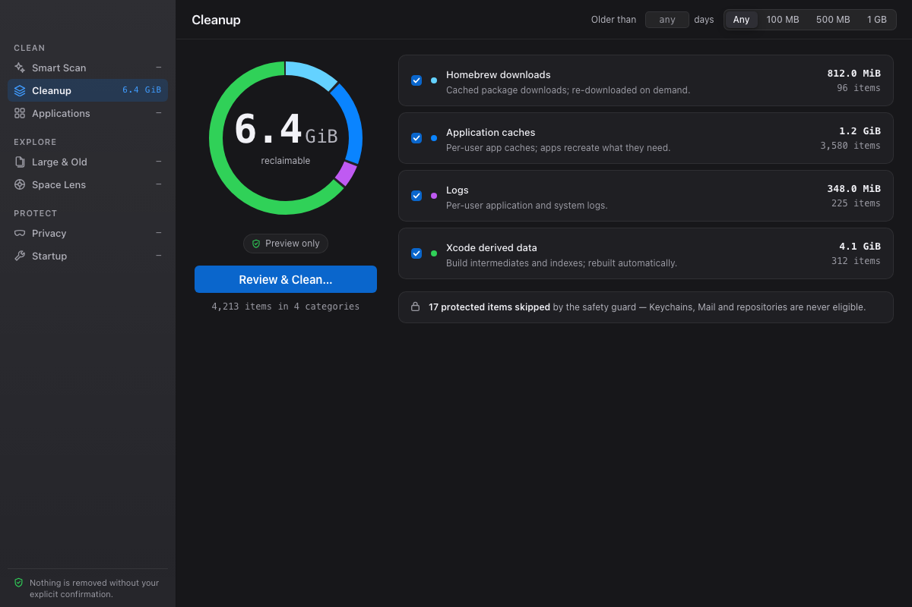
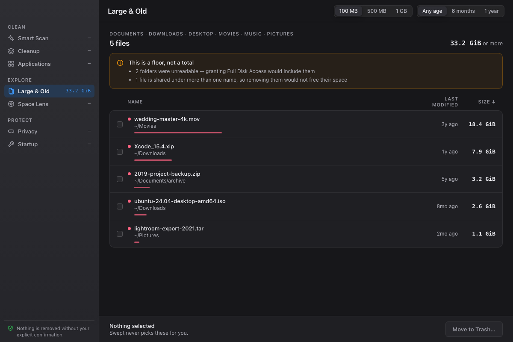
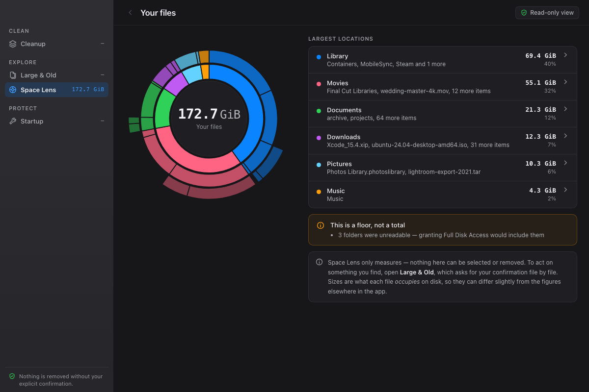
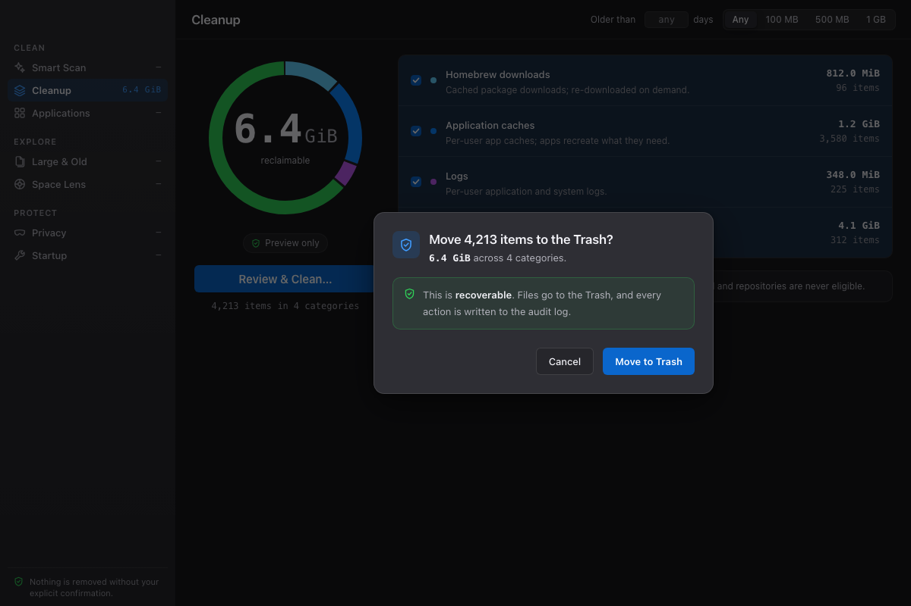
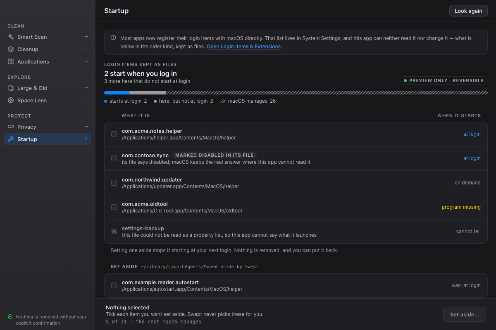

# Swept

[](https://github.com/cha-ndler/swept/actions/workflows/ci.yml)

A free, open-source alternative to CleanMyMac. It finds junk worth clearing,
shows you the large and forgotten files eating your disk, and reviews what runs
at login — and it **never removes anything on its own**. It previews exactly
what it would do and acts only on explicit consent.

> ⚠️ This is a data-destroying tool. Everything destructive goes through a
> safety kernel first — see [Safety model](#safety-model) below, the full
> contract in [`CLAUDE.md`](CLAUDE.md), and the plain-English version in
> [`docs/SAFETY.md`](docs/SAFETY.md).



## What it does today

| | |
|---|---|
| **Cleanup** | Application caches, logs, Xcode derived data, Homebrew downloads and the user Trash — grouped by category with sizes, counts and per-category selection. Confirmed once, then moved to the Trash. |
| **Large & Old** | The biggest files across `~/Documents`, `~/Downloads`, `~/Desktop`, `~/Movies`, `~/Music`, `~/Pictures` and `~/Library/Application Support`, with size and age filters. **Nothing is ever pre-selected here** — see [The two scopes](#the-two-scopes). |
| **Space Lens** | A sunburst of where the space actually went, with a breadcrumb to drill into any folder. It is **read-only and says so** — there is no command behind it that accepts anything back, so a wedge is a picture of your disk, never a proposal. |
| **Startup** | Read-only review of the login items in `~/Library/LaunchAgents`. |
| **Menu-bar extra** | The current reclaimable figure, and a way back to the window. It has deliberately **no quick-clean action** — clearing files from a menu means no preview and no confirmation. |
| **CLI** | The same engine as `swept`, for scripting and `--json` output. |

Everything it plans and everything it carries out is appended to a JSON-lines
audit log at `~/Library/Application Support/swept/audit.jsonl`.

<details>
<summary>More screenshots</summary>

**Large & Old** — nothing pre-selected, and the total is presented as a floor
when the walk could not see everything:



**Space Lens** — read-only, and it says so in the toolbar:



**The confirmation sheet** — what it will do, stated before it does it:



**Startup** — read-only:



These are rendered from the UX test harness against fixture data, not captured
from a running app on someone's Mac. That is on purpose: a screenshot of the
real thing is a screenshot of somebody's actual files.

</details>

## Install

**There is no signed release yet.** Code signing and notarization are wired up
but inactive until a Developer ID certificate exists, so anything you download
or build is unsigned, and macOS will say so.

### Build from source (the supported path today)

The CLI:

```bash
cargo build --release -p swept     # binary at target/release/swept
```

The desktop app:

```bash
cargo install tauri-cli --version "^2" --locked   # once
cd crates/gui && npm ci
cargo tauri build     # .app + .dmg under crates/gui/src-tauri/target/release/bundle
```

A build you made yourself runs without complaint — the quarantine flag below
only applies to downloads.

### Opening an unsigned download

On macOS 15 and later, the old right-click → **Open** shortcut no longer works.
If you download a `.dmg` from a CI run or a release:

1. Open the `.dmg` and drag **Swept** to Applications.
2. Launch it. macOS will refuse and say the developer cannot be verified.
3. Open **System Settings → Privacy & Security**, scroll to Security, and click
   **Open Anyway** next to the Swept message.
4. Launch it again and confirm.

Only do this for a build you obtained from this repository and are willing to
trust. If that is not you, build from source instead — it is three commands.

### Full Disk Access

`~/.Trash` and `~/Library/Containers` are protected by macOS privacy controls.
Without Full Disk Access the app can still scan, but it will find less than is
there — and it will **say so** rather than quietly showing a smaller number. The
app links straight to the right System Settings pane when it notices.

## CLI usage

```bash
swept scan                          # preview junk in allowlisted locations (read-only)
swept scan --older-than-days 30     # only files untouched for 30+ days
swept scan --min-size 100M          # only large files (4096, 500K, 100M, 2G, 1TiB)
swept scan --json                   # machine-readable plan (for scripts / a GUI)

swept clean                         # preview (nothing changes without --execute)
swept clean --execute               # move junk to the Trash (recoverable)
swept clean --execute --older-than-days 30 --min-size 100M  # filters compose
swept clean --execute --yes         # confirm past the mass-action threshold
swept clean --execute --permanent   # irreversible (per-action consent)
swept clean --execute --audit PATH  # write the audit log somewhere else

swept login-items                   # read-only: what runs at login (also --json)
```

Filters compose, the preview groups by category, and every planned and executed
action is recorded in the append-only audit log.

## Safety model

Three layers, in order of authority. The denylist is checked **first** and
always wins.

1. **Denylist** (`crates/safety/src/denylist.rs`) — refuses `/System`, `/usr`,
   `/bin`, `/sbin`, `/Library`, `/Applications`, `~/Library/Keychains`,
   `~/Library/Mail`, the home directory itself, anything inside a `.git`, and
   **any directory that contains one of those**. Comparisons fold case, because
   macOS volumes are case-insensitive and `realpath` does not normalise case —
   so `~/Library/mail` and a repository spelled `.GIT` are refused too.
2. **Path guard** (`crates/safety/src/path_guard.rs`) — canonicalizes (resolving
   symlinks), rejects `..`, then re-runs the denylist on the *resolved* path. It
   is the only constructor of `SafePath`, and it runs again immediately before
   every mutation as a TOCTOU defense. For a whole directory,
   `dir_guard.rs` walks the tree first and **fails closed**: if it cannot read
   every entry, it refuses to vouch for any of it.
3. **Allowlist** (`crates/safety/src/allowlist.rs`) — confines unattended
   cleanup to caches, logs, Xcode derived data and the user Trash.

`crates/core/src/executor.rs` is the only code in the project that changes the
filesystem, and only when handed explicit `Consent`. The default is a dry run.
Disposal moves files to the Trash; permanent removal takes a separate flag and
is confined to the allowlist even then.

### The two scopes

The app can *see* much more of your disk than it can ever *act on*:

> **Widen what we can see. Never widen what we can act on — escalate per file,
> with explicit consent.**

Large & Old reads your documents, downloads, media folders and application
support data. Nothing it finds is selectable by default, there is no
select-all, and the action stays disabled until you tick something yourself.
Acting on a row takes a **per-path grant**:
each path is re-guarded, has to already be its own canonical spelling (so a
symlink swapped in after the list was drawn cannot redirect it), is confined to
the folders that were searched, and has its size re-read from disk. If any
single item no longer matches what you confirmed, the **whole** request is
refused and recorded — a partial run is never what you agreed to.

## Build & test

```bash
cargo test --workspace                                   # the oracle
cargo clippy --workspace --all-targets -- -D warnings    # must be clean
cargo fmt --all --check
cargo run -p swept -- scan                            # read-only preview
```

The GUI is excluded from the Rust workspace (it builds a webview app) and has
its own checks:

```bash
cd crates/gui
npm ci && npm run build
npm run ux          # Playwright: screenshots + axe a11y + visual regression
cargo tauri dev     # run the app against your real home, read-only until you consent
```

`npm run ux` is the project's "is it pleasant?" oracle: it renders every screen
headlessly, fails on serious or critical accessibility violations, and compares
against committed visual baselines. It has caught real WCAG contrast bugs more
than once — see [`design/rubric.md`](design/rubric.md).

## Layout

```
crates/safety     trust kernel — denylist, path guard, dir guard, allowlist. Never removes anything.
crates/core       engine — scanner → plan → executor → audit log
crates/gui-core   tested command layer returning serializable DTOs
crates/gui        Tauri v2 desktop app (React + TypeScript + Tailwind)
crates/cli        the `swept` binary
design/           the design canvas, rubric and target artboards
```

## Contributing

Read [`CLAUDE.md`](CLAUDE.md) first — it holds the safety contract and the
test-first workflow that every change follows. Two rules matter more than the
rest:

- Tests run against throwaway temp directories. **Never a real path.**
- Any diff that adds or changes deletion, move, or overwrite logic gets an
  adversarial safety review before it is opened.

## License

MIT — see [`LICENSE`](LICENSE).
