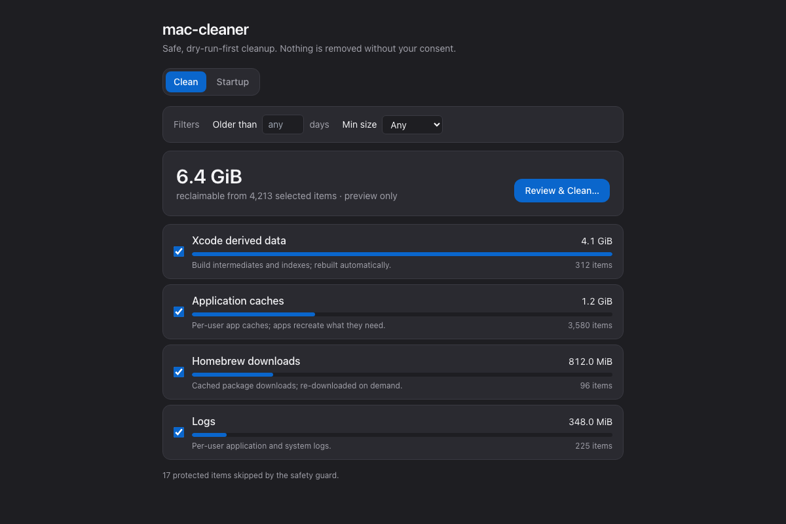

# mac-cleaner

[](https://github.com/cha-ndler/mac-cleaner/actions/workflows/ci.yml)

A free, open-source alternative to CleanMyMac. Finds junk to clean, recommends
performance tweaks, scans for app updates, and assists with clutter removal —
and **never deletes anything automatically**. It previews exactly what it would
remove and acts only on explicit consent.

> ⚠️ This is a data-destroying tool. Every destructive path is built around a
> safety substrate first (see [`CLAUDE.md`](CLAUDE.md) → SAFETY CONTRACT).

## Status

**v0.2** — a pleasant **desktop GUI** (Tauri) on top of the v0.1 CLI: a Clean
view (categories, selection, reclaimable-space bars, age/size filters), a
Trash-only clean flow with a confirmation modal, and a read-only Startup
(login-items) review. Same property-tested safety substrate; the GUI is a thin
front-end over `macclean-core` — all deletion still routes through the
consent-gated executor.




### GUI (Tauri)

```bash
cargo install tauri-cli --version "^2" --locked   # once
cd crates/gui && npm install
cargo tauri dev      # run the app
cargo tauri build    # build mac-cleaner.app + .dmg (src-tauri/target/release/bundle)
```

The UX is guarded by an oracle: `npm run ux` renders each screen headlessly and
runs axe a11y + visual-regression checks (see `design/rubric.md`).

## Build & test

```bash
cargo test --workspace                                   # the oracle
cargo clippy --workspace --all-targets -- -D warnings    # must be clean
cargo run -p macclean -- scan                            # read-only preview
```

## Usage

```bash
macclean scan                          # preview junk in allowlisted locations (read-only)
macclean scan --older-than-days 30     # only files untouched for 30+ days
macclean scan --min-size 100M          # only large files (4096, 500K, 100M, 2G, 1TiB)
macclean scan --json                   # machine-readable plan (for scripts / a GUI)

macclean clean                         # preview (no changes without --execute)
macclean clean --execute               # move junk to the Trash (recoverable)
macclean clean --execute --older-than-days 30 --min-size 100M  # filters compose
macclean clean --execute --yes         # confirm a mass delete
macclean clean --execute --permanent   # irreversible (per-action consent)

macclean login-items                   # read-only: what runs at login (also --json)
```

Filters compose, the preview groups by category, and every planned and executed
action is written to an append-only audit log (default
`~/Library/Application Support/macclean/audit.jsonl`).

## Install

Grab the `macclean-macos` artifact from a CI run (or a tagged release), or build
from source with `cargo build --release -p macclean` (binary at
`target/release/macclean`).

## Safety model

Three layers, in order of authority:

1. **Denylist** (`crates/safety/denylist.rs`) — refuses system roots, keychains,
   mail, the home root, anything inside `.git`. Checked first; always wins.
2. **Path guard** (`crates/safety/path_guard.rs`) — canonicalizes (resolving
   symlinks), rejects `..`, re-checks the denylist. The only constructor of
   `SafePath`; re-run immediately before every mutation (TOCTOU defense).
3. **Allowlist** (`crates/safety/allowlist.rs`) — confines cleanup to caches,
   logs, Xcode derived data, and the user Trash.

The executor (`crates/core/executor.rs`) is the only code that mutates the
filesystem, and only under explicit `Consent`. Default is a dry run.

## Layout

```
crates/safety  trust kernel (denylist, path guard, allowlist) — never deletes
crates/core    scanner → plan → executor → audit
crates/cli     macclean binary
```

## License

MIT
